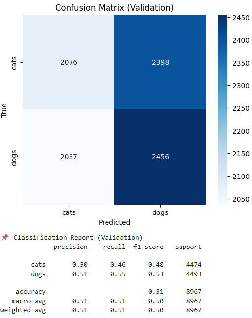

# 🐶 Cats vs Dogs CNN Classification

## Projenin Amacı
Bu proje, Convolutional Neural Network (CNN) kullanarak köpek ve kedi resimlerini sınıflandırmayı amaçlamaktadır. Amaç, temel bir derin öğrenme modeli ile yüksek doğrulukta sınıflandırma yapmak ve eğitim/validation sürecini görselleştirmektir.
Kaggle Linki [Cats vs Dogs Classification](https://www.kaggle.com/code/yaskucuker/dogs-vs-cats-model)
---

## Veri Seti
- **Kaynak:** [Kaggle Dogs vs Cats](https://www.kaggle.com/c/dogs-vs-cats/data)  
- **Toplam Eğitim Verisi:** 35,960 resim  
  - Train Cats: 11,974  
  - Train Dogs: 11,993  
  - Validation Cats: 4,474  
  - Validation Dogs: 4,493  
- **Format:** JPEG, farklı boyutlarda  

### Örnek Resimler
| Kedi | Köpek |
|------|-------|
|  |  |

---

## Kullanılan Yöntemler

### 1. Veri Ön İşleme & Data Augmentation
- Resimleri 150x150 boyutuna yeniden boyutlandırma  
- Normalizasyon: `rescale=1./255`  
- Data augmentation: rotation, width/height shift, shear, zoom, horizontal flip  
- Train/Validation split: %73 train, %27 validation  

### 2. Model Mimarisi
- CNN (Sequential)  
- 3 x Conv2D + MaxPooling2D  
- Flatten → Dense(128, ReLU) + Dropout(0.5)  
- Output: Dense(1, sigmoid) (binary classification)  
- Optimizer: Adam (learning_rate=0.001)  
- Loss: Binary Crossentropy  

### 3. Eğitim Parametreleri
- Epoch: 15  
- Batch size: 32  
- Validation set ile doğrulama  

---

## Model Performansı

### Confusion Matrix (Validation Set)

### Classification Report
| Class | Precision | Recall | F1-score | Support |
|-------|----------|--------|----------|--------|
| Cats  | 0.50     | 0.46   | 0.48     | 4,474  |
| Dogs  | 0.51     | 0.55   | 0.53     | 4,493  |
| **Accuracy** | | | 0.51 | 8,967 |

### Örnek Tahmin Görselleri
Tüm örnek görseller doğru sınıflandırılmıştır.

| Tahmin: Cat | Tahmin: Dog |
|-------------|-------------|
|  |  |
|  |  |

---

## Sonuçlar
- Model validation set üzerinde yaklaşık **%51 doğruluk** sağladı.  
- Tüm örnek görseller doğru sınıflandırıldı.  
- CNN ve data augmentation kullanımı, temel bir sınıflandırma için uygundur.  
- Daha iyi performans için transfer learning (VGG16, ResNet50 vb.) kullanılabilir.

---

## Notlar
- Görseller `images/` klasöründe yer almalıdır.  
- Model, Kaggle ortamında veya lokal olarak çalıştırılabilir.  
